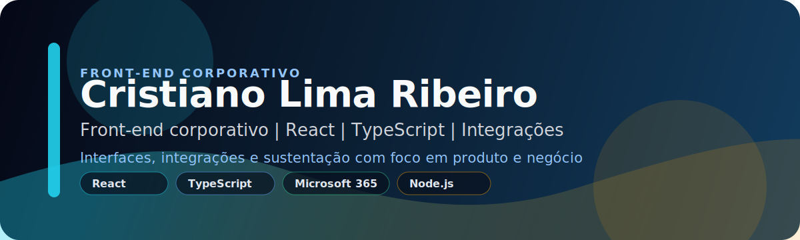

# Cristiano Lima Ribeiro

<strong>Desenvolvedor Front-end focado em produtos corporativos, integrações e boa experiência de uso.</strong>

Petrópolis, Rio de Janeiro, Brasil

  
  
  
  

  
  
  
  

  
  
  
  

## Sobre mim

Sou desenvolvedor front-end com experiência em aplicações corporativas, portais digitais e integrações com ecossistemas internos.

Atuo com foco em interfaces claras, escaláveis e alinhadas ao contexto do negócio, unindo técnica, visão funcional e boa experiência para o usuário.

Tenho base anterior em suporte, infraestrutura, análise de sistemas e MySQL, o que ajuda na sustentação, na confiabilidade e na leitura de ponta a ponta dos sistemas.

<table>
  <tr>
    <td width="50%" valign="top">
      <strong>O que entrego</strong> 
      Interfaces corporativas, automação de processos, integrações com APIs e sustentação de soluções internas.
    </td>
    <td width="50%" valign="top">
      <strong>O que me diferencia</strong> 
      Visão de ponta a ponta, bagagem em suporte e infraestrutura, boa comunicação com negócio e foco em confiabilidade.
    </td>
  </tr>
</table>

## Em resumo

- Atuação forte em React, TypeScript, JavaScript, Node.js e front-end corporativo.
- Experiência em aplicações internas, automação, sustentação e integração de APIs.
- Microsoft 365 e SharePoint aparecem como parte do contexto corporativo em que atuo.
- Perfil orientado a entrega, com linguagem clara para negócio e TI.

## Stack

### Front-end

  
  
  
  
  
  

### Plataformas corporativas

  
  
  
  
  
  

### Back-end e dados

  
  
  
  

### Qualidade e processo

  
  
  
  
  

## Experiência

### Ímpar
**Desenvolvedor** | junho de 2022 - atual

- Desenvolvimento de interfaces corporativas com React.js, TypeScript e SCSS, priorizando usabilidade, performance e manutenção.
- Integração de aplicações front-end com APIs REST, Microsoft Graph e serviços do ecossistema Microsoft 365.
- Apoio a automações com Power Automate, levantamento de requisitos, documentação técnica e sustentação.

### Informarca Comércio e Serviços LTDA
**Analista de Suporte Técnico em Software** | janeiro de 2019 - maio de 2022

- Suporte a usuários de software de gestão desenvolvido internamente.
- Testes de versão, validação funcional e comunicação de ajustes ao time responsável.
- Uso de MySQL para consultas, validações e apoio à sustentação do sistema.

### Informarca Comércio e Serviços LTDA
**Analista de Infraestrutura de TI** | dezembro de 2010 - janeiro de 2019

- Administração e suporte de redes, servidores, estações de trabalho e ambiente corporativo.
- Criação e manutenção de políticas de segurança, backup e controle de acessos.
- Sustentação de ambientes e melhoria de processos internos.

## Formação

- **Pós-graduação em Engenharia de Software**  
  Descomplica Faculdade Digital | junho de 2024 - abril de 2025
- **Superior de Tecnologia em Análise e Desenvolvimento de Sistemas**  
  UNOPAR | fevereiro de 2015 - dezembro de 2018
- **Bacharelado em Psicologia**  
  Universidade Católica de Petrópolis | 2009 - 2013

## Idiomas

- Português: nativo
- Inglês: profissional

## Contato

  
  
  
  

